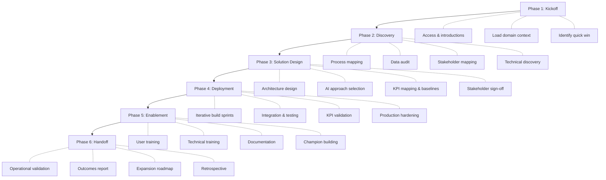

# Engagement Lifecycle

The end-to-end flow an FDE follows from day one through handoff.

```mermaid
flowchart TD
    K[Phase 1: Kickoff] --> D[Phase 2: Discovery]
    D --> SD[Phase 3: Solution Design]
    SD --> DEP[Phase 4: Deployment]
    DEP --> EN[Phase 5: Enablement]
    EN --> H[Phase 6: Handoff]

    K -.- k1[Access & introductions]
    K -.- k2[Load domain context]
    K -.- k3[Identify quick win]

    D -.- d1[Process mapping]
    D -.- d2[Data audit]
    D -.- d3[Stakeholder mapping]
    D -.- d4[Technical discovery]

    SD -.- sd1[Architecture design]
    SD -.- sd2[AI approach selection]
    SD -.- sd3[KPI mapping & baselines]
    SD -.- sd4[Stakeholder sign-off]

    DEP -.- dep1[Iterative build sprints]
    DEP -.- dep2[Integration & testing]
    DEP -.- dep3[KPI validation]
    DEP -.- dep4[Production hardening]

    EN -.- en1[User training]
    EN -.- en2[Technical training]
    EN -.- en3[Documentation]
    EN -.- en4[Champion building]

    H -.- h1[Operational validation]
    H -.- h2[Outcomes report]
    H -.- h3[Expansion roadmap]
    H -.- h4[Retrospective]
```
