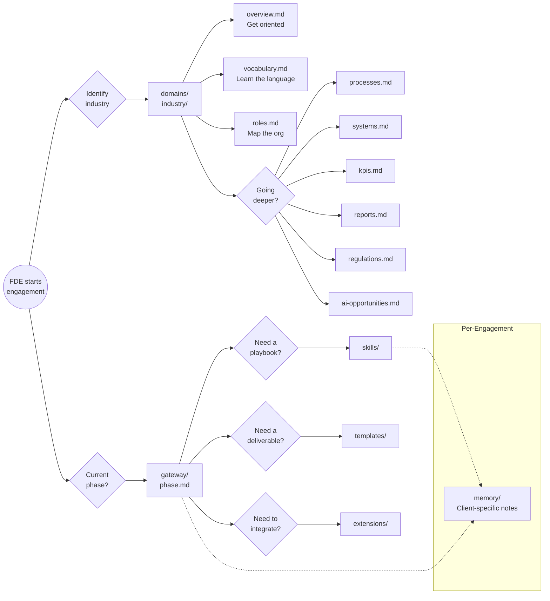

# Repo Navigation Flow

How an FDE navigates this repo when starting or running an engagement.

```mermaid
flowchart LR
    START((FDE starts\nengagement)) --> ID{Identify\nindustry}

    ID --> DOM[domains/\nindustry/]
    DOM --> OV[overview.md\nGet oriented]
    DOM --> VOC[vocabulary.md\nLearn the language]
    DOM --> ROLES[roles.md\nMap the org]

    START --> PHASE{Current\nphase?}
    PHASE --> GW[gateway/\nphase.md]

    GW --> SK{Need a\nplaybook?}
    SK --> SKILLS[skills/]

    GW --> DEL{Need a\ndeliverable?}
    DEL --> TMPL[templates/]

    GW --> TECH{Need to\nintegrate?}
    TECH --> EXT[extensions/]

    DOM --> DEEP{Going\ndeeper?}
    DEEP --> PROC[processes.md]
    DEEP --> SYS[systems.md]
    DEEP --> KPI[kpis.md]
    DEEP --> REP[reports.md]
    DEEP --> REG[regulations.md]
    DEEP --> AI[ai-opportunities.md]

    subgraph Per-Engagement
        MEM[memory/\nClient-specific notes]
    end

    GW -.-> MEM
    SKILLS -.-> MEM
```
