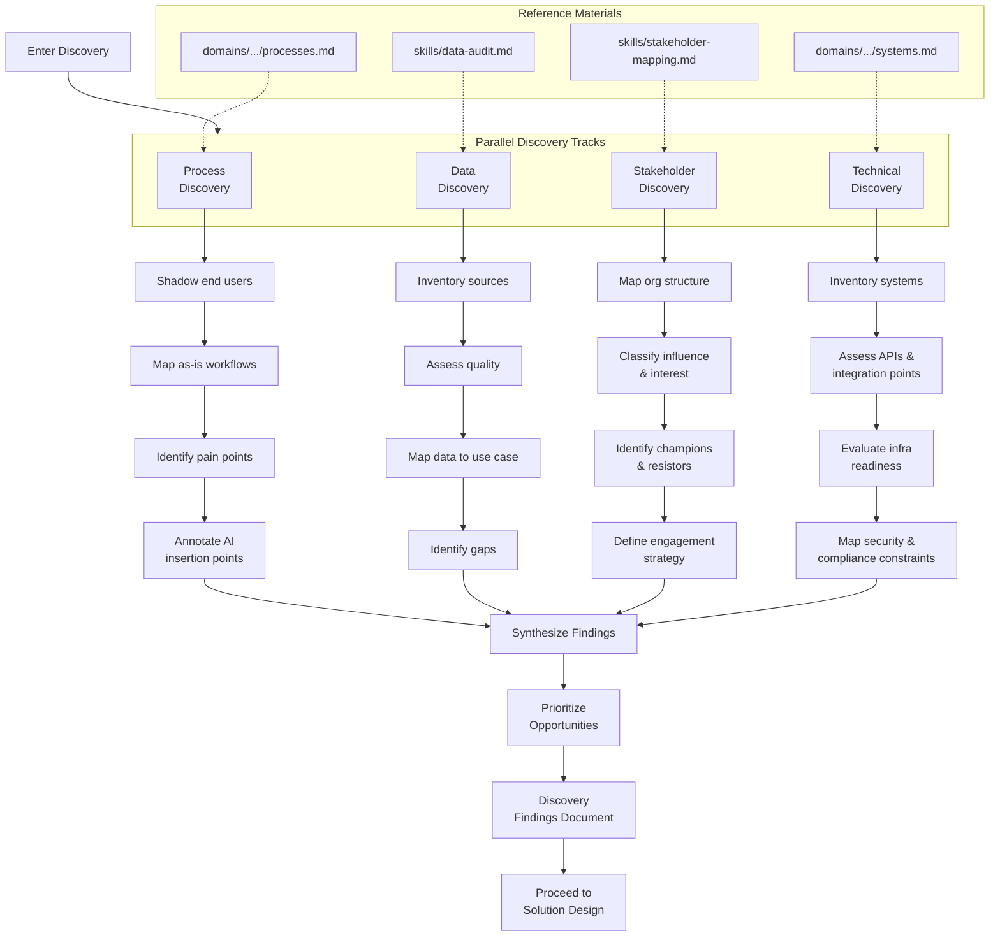

# Discovery Phase Workflow

Detailed flow for Phase 2, the most critical information-gathering phase.

```mermaid
flowchart TD
    START[Enter Discovery] --> PAR

    subgraph PAR [Parallel Discovery Tracks]
        direction LR
        PROC[Process\nDiscovery]
        DATA[Data\nDiscovery]
        STAKE[Stakeholder\nDiscovery]
        TECH[Technical\nDiscovery]
    end

    PROC --> PROC1[Shadow end users]
    PROC1 --> PROC2[Map as-is workflows]
    PROC2 --> PROC3[Identify pain points]
    PROC3 --> PROC4[Annotate AI\ninsertion points]

    DATA --> DATA1[Inventory sources]
    DATA1 --> DATA2[Assess quality]
    DATA2 --> DATA3[Map data to use case]
    DATA3 --> DATA4[Identify gaps]

    STAKE --> STAKE1[Map org structure]
    STAKE1 --> STAKE2[Classify influence\n& interest]
    STAKE2 --> STAKE3[Identify champions\n& resistors]
    STAKE3 --> STAKE4[Define engagement\nstrategy]

    TECH --> TECH1[Inventory systems]
    TECH1 --> TECH2[Assess APIs &\nintegration points]
    TECH2 --> TECH3[Evaluate infra\nreadiness]
    TECH3 --> TECH4[Map security &\ncompliance constraints]

    PROC4 --> SYNTH[Synthesize Findings]
    DATA4 --> SYNTH
    STAKE4 --> SYNTH
    TECH4 --> SYNTH

    SYNTH --> PRI[Prioritize\nOpportunities]
    PRI --> DOC[Discovery\nFindings Document]
    DOC --> NEXT[Proceed to\nSolution Design]

    subgraph Reference Materials
        direction LR
        R1[domains/.../processes.md]
        R2[skills/data-audit.md]
        R3[skills/stakeholder-mapping.md]
        R4[domains/.../systems.md]
    end

    R1 -.-> PROC
    R2 -.-> DATA
    R3 -.-> STAKE
    R4 -.-> TECH
```
