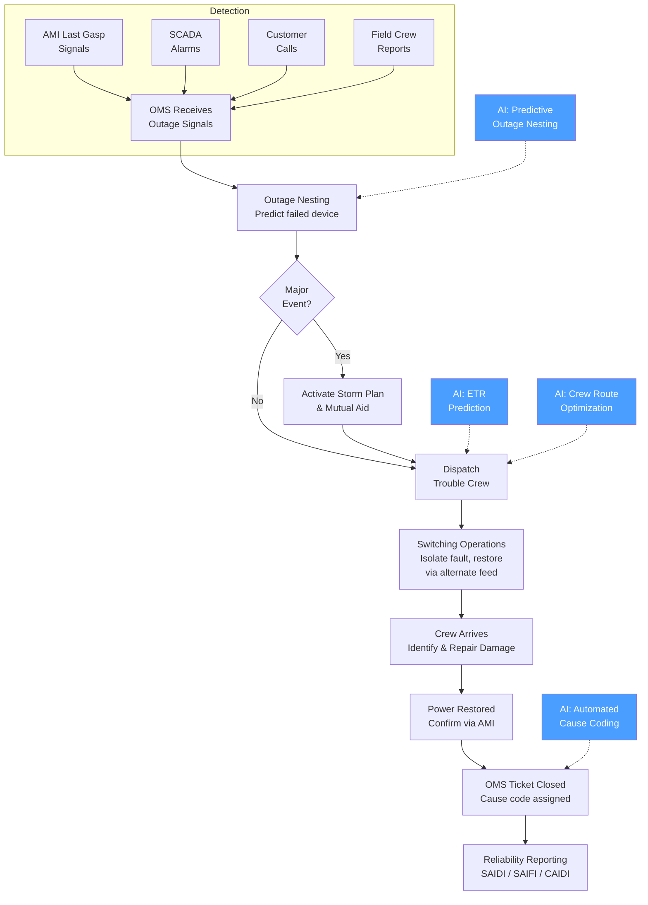

# T&D Outage Management Process

The core outage lifecycle from detection to restoration, with AI augmentation points.

```mermaid
flowchart TD
    subgraph Detection
        AMI[AMI Last Gasp\nSignals] --> OMS
        SCADA[SCADA\nAlarms] --> OMS
        CUST[Customer\nCalls] --> OMS
        CREW_RPT[Field Crew\nReports] --> OMS
    end

    OMS[OMS Receives\nOutage Signals] --> NEST[Outage Nesting\nPredict failed device]
    NEST --> ASSESS{Major\nEvent?}

    ASSESS -->|No| DISPATCH[Dispatch\nTrouble Crew]
    ASSESS -->|Yes| STORM[Activate Storm Plan\n& Mutual Aid]
    STORM --> DISPATCH

    DISPATCH --> SWITCH[Switching Operations\nIsolate fault, restore\nvia alternate feed]
    SWITCH --> REPAIR[Crew Arrives\nIdentify & Repair Damage]
    REPAIR --> RESTORE[Power Restored\nConfirm via AMI]
    RESTORE --> CLOSE[OMS Ticket Closed\nCause code assigned]
    CLOSE --> REPORT[Reliability Reporting\nSAIDI / SAIFI / CAIDI]

    style AI1 fill:#4a9eff,color:#fff
    style AI2 fill:#4a9eff,color:#fff
    style AI3 fill:#4a9eff,color:#fff
    style AI4 fill:#4a9eff,color:#fff

    AI1[AI: Predictive\nOutage Nesting] -.-> NEST
    AI2[AI: ETR\nPrediction] -.-> DISPATCH
    AI3[AI: Crew Route\nOptimization] -.-> DISPATCH
    AI4[AI: Automated\nCause Coding] -.-> CLOSE
```
