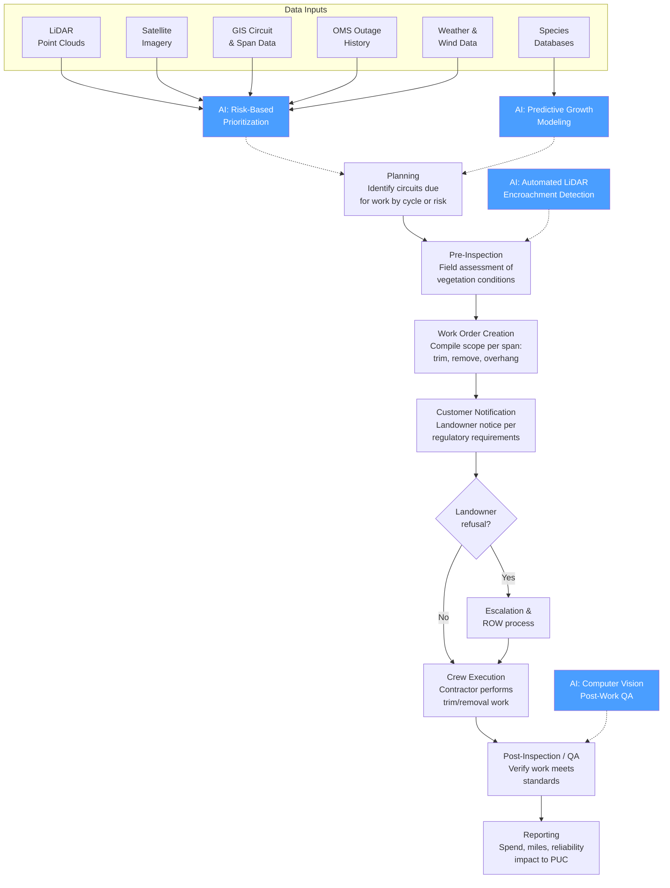

# T&D Vegetation Management Process

Vegetation management lifecycle with AI augmentation points.

```mermaid
flowchart TD
    PLAN[Planning\nIdentify circuits due\nfor work by cycle or risk] --> INSPECT[Pre-Inspection\nField assessment of\nvegetation conditions]
    INSPECT --> WO[Work Order Creation\nCompile scope per span:\ntrim, remove, overhang]
    WO --> NOTIFY[Customer Notification\nLandowner notice per\nregulatory requirements]
    NOTIFY --> REFUSAL{Landowner\nrefusal?}
    REFUSAL -->|Yes| ESC[Escalation &\nROW process]
    REFUSAL -->|No| EXEC[Crew Execution\nContractor performs\ntrim/removal work]
    ESC --> EXEC
    EXEC --> QA[Post-Inspection / QA\nVerify work meets\nstandards]
    QA --> RPT[Reporting\nSpend, miles, reliability\nimpact to PUC]

    subgraph Data Inputs
        direction LR
        LIDAR[LiDAR\nPoint Clouds]
        SAT[Satellite\nImagery]
        GIS[GIS Circuit\n& Span Data]
        OUTAGE[OMS Outage\nHistory]
        SPECIES[Species\nDatabases]
        WEATHER[Weather &\nWind Data]
    end

    style AI1 fill:#4a9eff,color:#fff
    style AI2 fill:#4a9eff,color:#fff
    style AI3 fill:#4a9eff,color:#fff
    style AI4 fill:#4a9eff,color:#fff

    AI1[AI: Risk-Based\nPrioritization] -.-> PLAN
    AI2[AI: Automated LiDAR\nEncroachment Detection] -.-> INSPECT
    AI3[AI: Predictive Growth\nModeling] -.-> PLAN
    AI4[AI: Computer Vision\nPost-Work QA] -.-> QA

    LIDAR --> AI1
    SAT --> AI1
    GIS --> AI1
    OUTAGE --> AI1
    SPECIES --> AI3
    WEATHER --> AI1
```
