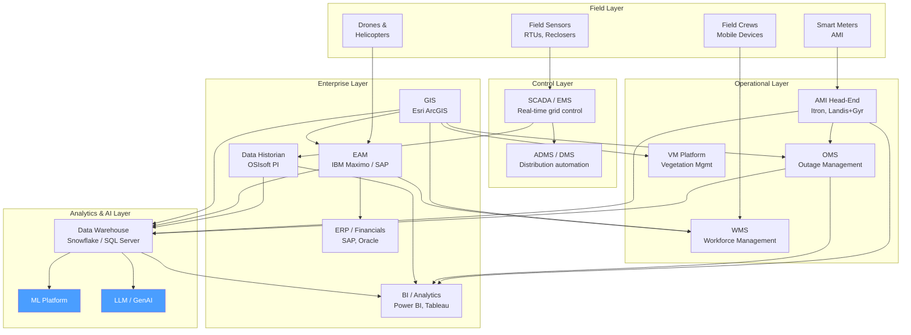

# T&D Utility Systems Landscape

How the major systems connect across the IT/OT stack.

```mermaid
flowchart TD
    subgraph Field Layer
        METERS[Smart Meters\nAMI]
        SENSORS[Field Sensors\nRTUs, Reclosers]
        CREWS[Field Crews\nMobile Devices]
        DRONES[Drones &\nHelicopters]
    end

    subgraph Control Layer
        SCADA[SCADA / EMS\nReal-time grid control]
        ADMS[ADMS / DMS\nDistribution automation]
    end

    subgraph Operational Layer
        AMI_HE[AMI Head-End\nItron, Landis+Gyr]
        OMS[OMS\nOutage Management]
        WMS[WMS\nWorkforce Management]
        VM[VM Platform\nVegetation Mgmt]
    end

    subgraph Enterprise Layer
        GIS[GIS\nEsri ArcGIS]
        EAM[EAM\nIBM Maximo / SAP]
        ERP[ERP / Financials\nSAP, Oracle]
        BI[BI / Analytics\nPower BI, Tableau]
        PI[Data Historian\nOSIsoft PI]
    end

    subgraph Analytics & AI Layer
        DW[Data Warehouse\nSnowflake / SQL Server]
        ML[ML Platform]
        LLM[LLM / GenAI]
    end

    METERS --> AMI_HE
    SENSORS --> SCADA
    CREWS --> WMS
    DRONES --> EAM

    SCADA --> ADMS
    SCADA --> PI
    AMI_HE --> OMS
    AMI_HE --> BI

    GIS --> OMS
    GIS --> WMS
    GIS --> VM
    GIS --> EAM
    EAM --> WMS
    EAM --> ERP
    OMS --> BI
    PI --> BI

    PI --> DW
    OMS --> DW
    EAM --> DW
    AMI_HE --> DW
    GIS --> DW
    DW --> ML
    DW --> LLM
    DW --> BI

    style ML fill:#4a9eff,color:#fff
    style LLM fill:#4a9eff,color:#fff
```
