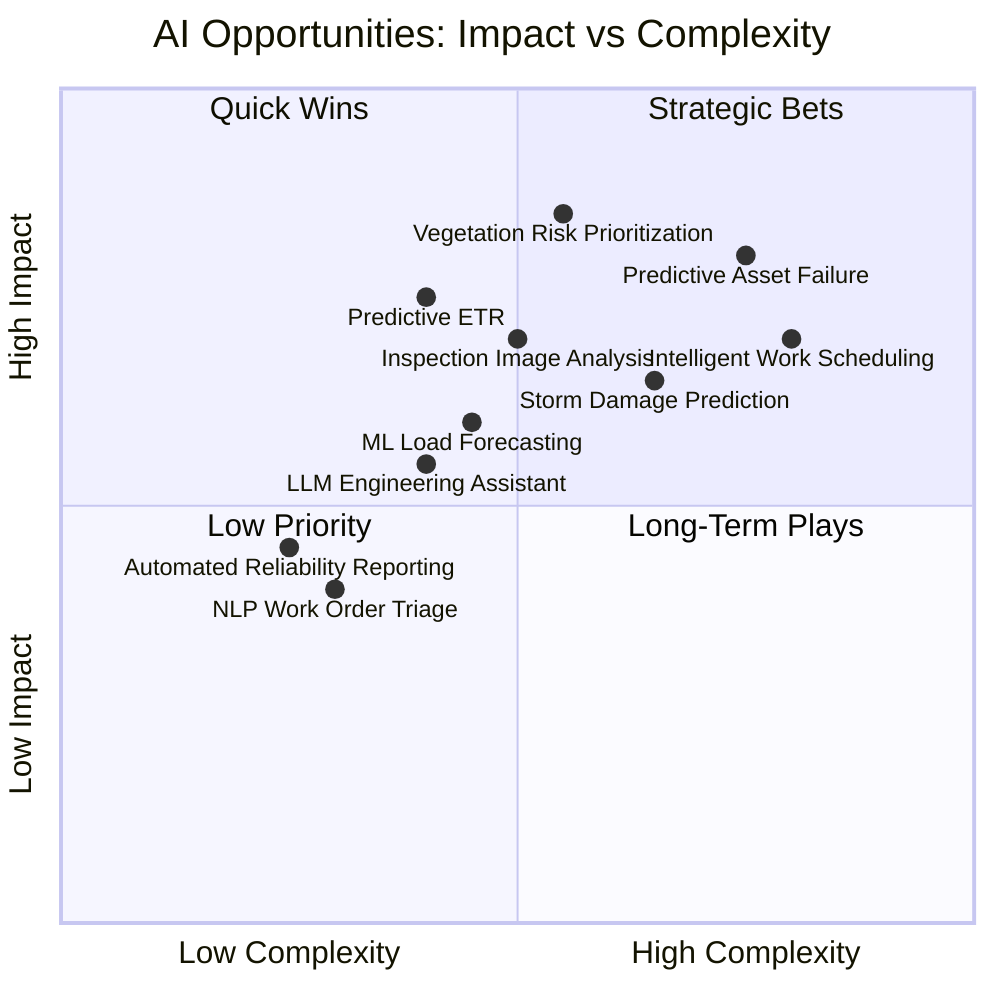
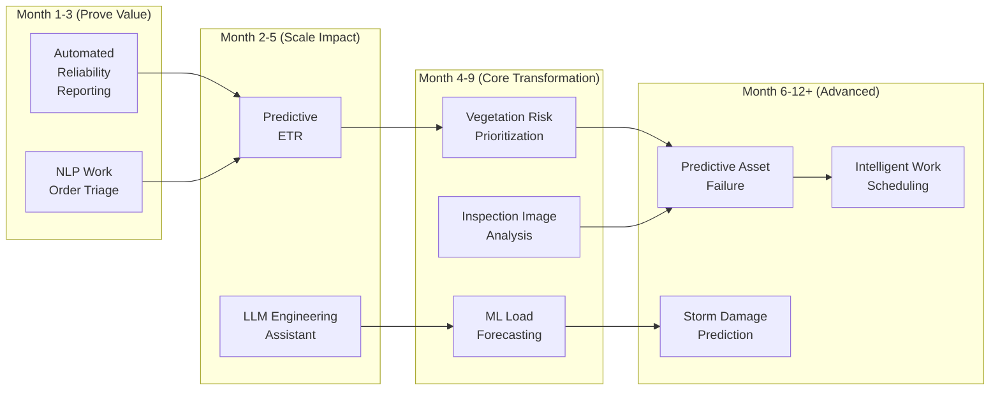

# AI Opportunity Prioritization Matrix

How to evaluate and sequence AI opportunities at a T&D utility engagement.

```mermaid
quadrantChart
    title AI Opportunities: Impact vs Complexity
    x-axis Low Complexity --> High Complexity
    y-axis Low Impact --> High Impact
    quadrant-1 Strategic Bets
    quadrant-2 Quick Wins
    quadrant-3 Low Priority
    quadrant-4 Long-Term Plays
    Automated Reliability Reporting: [0.25, 0.45]
    NLP Work Order Triage: [0.30, 0.40]
    Predictive ETR: [0.40, 0.75]
    LLM Engineering Assistant: [0.40, 0.55]
    ML Load Forecasting: [0.45, 0.60]
    Vegetation Risk Prioritization: [0.55, 0.85]
    Inspection Image Analysis: [0.50, 0.70]
    Storm Damage Prediction: [0.65, 0.65]
    Predictive Asset Failure: [0.75, 0.80]
    Intelligent Work Scheduling: [0.80, 0.70]
```

## Sequencing Recommendation

```mermaid
flowchart LR
    subgraph "Month 1-3 (Prove Value)"
        A[Automated\nReliability\nReporting]
        B[NLP Work\nOrder Triage]
    end

    subgraph "Month 2-5 (Scale Impact)"
        C[Predictive\nETR]
        D[LLM Engineering\nAssistant]
    end

    subgraph "Month 4-9 (Core Transformation)"
        E[Vegetation Risk\nPrioritization]
        F[Inspection Image\nAnalysis]
        G[ML Load\nForecasting]
    end

    subgraph "Month 6-12+ (Advanced)"
        H[Predictive Asset\nFailure]
        I[Intelligent Work\nScheduling]
        J[Storm Damage\nPrediction]
    end

    A --> C
    B --> C
    C --> E
    D --> G
    E --> H
    F --> H
    G --> J
    H --> I
```
