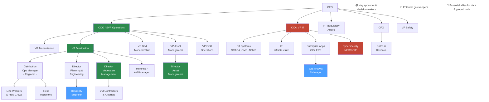

# T&D Utility Organizational Structure

Typical IOU org chart with FDE engagement relevance.

```mermaid
flowchart TD
    CEO[CEO]

    CEO --> COO[COO / SVP Operations]
    CEO --> CIO[CIO / VP IT]
    CEO --> REG[VP Regulatory\nAffairs]
    CEO --> CFO[CFO]
    CEO --> SAFETY[VP Safety]

    COO --> VPT[VP Transmission]
    COO --> VPD[VP Distribution]
    COO --> VPGM[VP Grid\nModernization]
    COO --> VPAM[VP Asset\nManagement]
    COO --> VPFO[VP Field\nOperations]

    VPD --> DOM[Distribution\nOps Manager\n- Regional -]
    VPD --> DPE[Director\nPlanning &\nEngineering]
    VPD --> DVM[Director\nVegetation\nManagement]
    VPD --> AMI_M[Metering /\nAMI Manager]

    VPAM --> DAM[Director\nAsset\nManagement]

    CIO --> OT[OT Systems\nSCADA, OMS, ADMS]
    CIO --> IT[IT\nInfrastructure]
    CIO --> EA[Enterprise Apps\nGIS, ERP]
    CIO --> CYBER[Cybersecurity\nNERC CIP]

    DOM --> CREW[Line Workers\n& Field Crews]
    DOM --> INSP[Field\nInspectors]
    DVM --> CONTR[VM Contractors\n& Arborists]
    DPE --> RE[Reliability\nEngineer]
    EA --> GIS_A[GIS Analyst\n/ Manager]

    CFO --> RATES[Rates &\nRevenue]

    style COO fill:#2d8a4e,color:#fff
    style CIO fill:#c44536,color:#fff
    style VPD fill:#2d8a4e,color:#fff
    style DVM fill:#2d8a4e,color:#fff
    style DAM fill:#2d8a4e,color:#fff
    style RE fill:#4a9eff,color:#fff
    style GIS_A fill:#4a9eff,color:#fff
    style CYBER fill:#c44536,color:#fff

    classDef legend fill:none,stroke:none
    L1[🟢 Key sponsors & decision-makers]:::legend
    L2[🔴 Potential gatekeepers]:::legend
    L3[🔵 Essential allies for data & ground truth]:::legend
```
