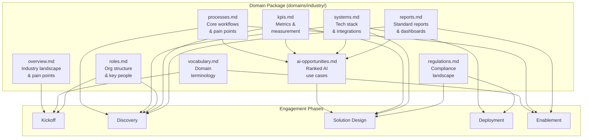
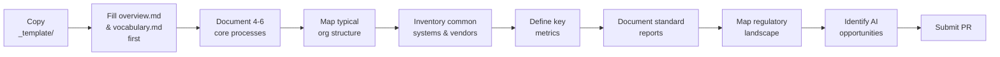

# Domain Knowledge Structure

How domain files interconnect and inform each phase of the engagement.

```mermaid
flowchart TD
    subgraph "Domain Package (domains/industry/)"
        OV[overview.md\nIndustry landscape\n& pain points]
        PROC[processes.md\nCore workflows\n& pain points]
        ROLES[roles.md\nOrg structure\n& key people]
        SYS[systems.md\nTech stack\n& integrations]
        KPI[kpis.md\nMetrics &\nmeasurement]
        RPT[reports.md\nStandard reports\n& dashboards]
        REG[regulations.md\nCompliance\nlandscape]
        VOC[vocabulary.md\nDomain\nterminology]
        AIO[ai-opportunities.md\nRanked AI\nuse cases]
    end

    subgraph "Engagement Phases"
        P1[Kickoff]
        P2[Discovery]
        P3[Solution Design]
        P4[Deployment]
        P5[Enablement]
    end

    OV --> P1
    VOC --> P1
    ROLES --> P1

    PROC --> P2
    SYS --> P2
    ROLES --> P2
    KPI --> P2
    RPT --> P2

    AIO --> P3
    KPI --> P3
    SYS --> P3
    REG --> P3

    SYS --> P4
    REG --> P4

    VOC --> P5
    PROC --> P5
    RPT --> P5

    PROC --> AIO
    KPI --> AIO
    SYS --> AIO
    RPT --> AIO
```

## Adding a New Domain

```mermaid
flowchart LR
    COPY[Copy\n_template/] --> FILL[Fill overview.md\n& vocabulary.md\nfirst]
    FILL --> PROC[Document 4-6\ncore processes]
    PROC --> ROLES[Map typical\norg structure]
    ROLES --> SYS[Inventory common\nsystems & vendors]
    SYS --> KPI[Define key\nmetrics]
    KPI --> RPT[Document standard\nreports]
    RPT --> REG[Map regulatory\nlandscape]
    REG --> AIO[Identify AI\nopportunities]
    AIO --> PR[Submit PR]
```
