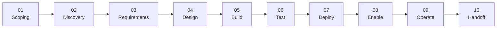
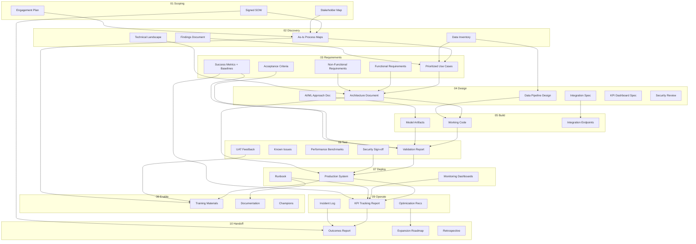
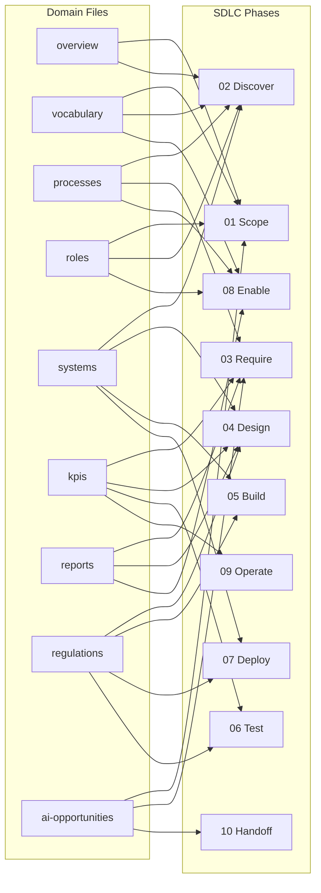

# SDLC Input → Action → Output Chain

Full traceability of artifacts across all 10 phases.

## Phase Flow

## Artifact Flow

Shows what each phase produces and where it goes.

## Domain Knowledge Touchpoints

